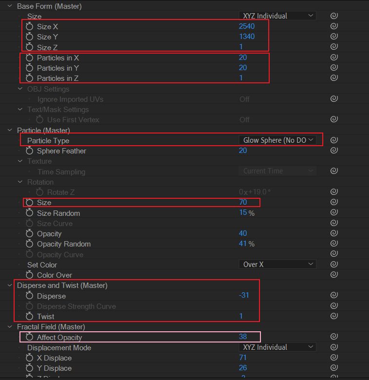
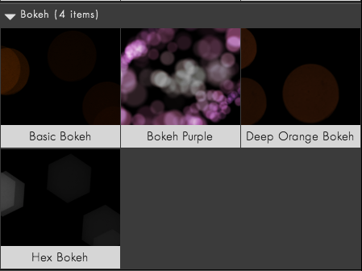

# 探索：梦幻泡泡背景

## 简介

探索梦幻泡泡背景的实现。

## 功能需求

- 泡泡必须支持在XY平面随机移动。

## 性能需求

无。

## 实现

### 实现1：基于Form插件的实现

新建纯色层，添加Form插件效果。

关键参数说明：

- Base Form 部分，将XY空间拉大，Z空间去掉。同时设置合理的XY维度的粒子数量。
- Particular部分，设置粒子类型为发光粒子，合理设置粒子size大小。
- Disperse and Twist部分，Disperse 和 Twist 可以扰乱和扭曲粒子的位置分布。这里主要是寻找一个合适的随机位置分布。
- Fractal Field部分，这里是粒子随机运动的关键。将Affect Opacity设置为一个合理的正值。于是粒子的opacity就会发生随机的分形替换，视觉上就是粒子在随机移动，消失和出现。原理上，可以类比之前熟悉的分形杂色效果。

---

如果感兴趣的话，也可以在Form 预设中找到类似的预设，直接应用后微调参数，也能达到和上面类似的效果。

## 小结

暂时只给出梦幻泡泡的Form实现。
