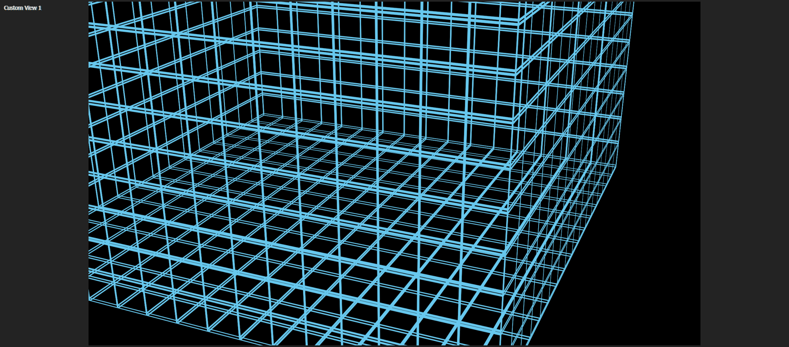
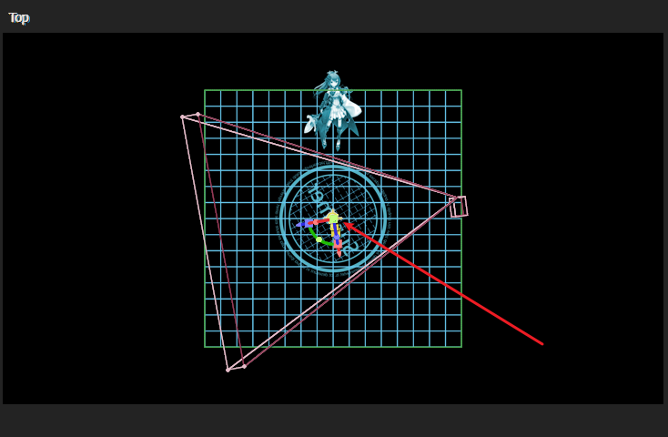
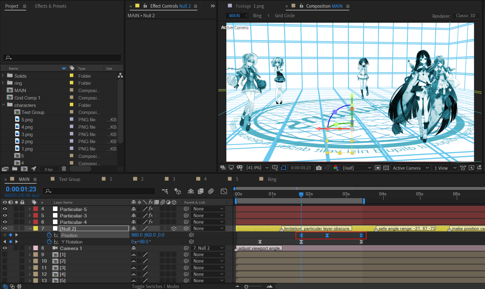

# 仿2010夏季OP网格盒子


该教程为浅蓝晰教程的图文版，略有简化。


## 步骤概述

- 构建3D网格盒子
- 绘制环形
- 加入人物
- 制作摄像机动画
- 制作环形的动画
- 制作人物部分的动画
- 细节：添加动态模糊

新建 1920 x 1080，10s长度的合成MAIN。初始化摄像机。


## 构建3D网格盒子

新建1920x1920的空合成，Grid Comp 1。

在里面新建1920x1920的纯色层Grid，添加网格效果。并设置合理的参数。


---

利用Grid Comp 1的副本和调节transform参数，构建一个完美的正方形盒子。


---

再次通过Grid Comp 1的副本，对每一个副本，全部设置Y轴轻微位置上移，例如上移10px。这样，就得到了两层的网格效果。





## 绘制环形

新建1920x1920的合成，Ring。

我们要绘制下面的静态图形。


分别是：

- 两个圆形描边，外圆描边大，内圆描边小。
- 一个文字圆环。在文本层上绘制同心圆mask，设置文本路径为这个圆mask。文字填充使用Wordsmith.jsxbin脚本快速创建。
- 内部区域的网格效果。
- 居中的文本层。

内部区域的网格效果，在下面进行详细说明。


在一个1920x1920的合成Grid Circle中，分别绘制网格，添加调节层：百叶窗，新建文本层。

其中，百叶窗效果经过合理设置参数后，可以在竖直方向切断网格，如图所示。

然后，回到Ring合成中，复制一层内圆描边，作为这个Grid Circle合成的遮罩。Grid Circle设置Alpha遮罩。


此时，Ring合成的静止部分已经完成。

我们可以将这个Ring放入MAIN合成中，放于地面上。

| Custom View 1                                                | TOP                                                          |
| ------------------------------------------------------------ | ------------------------------------------------------------ |
|  |  |


## 加入人物

导入五张示例人物立绘（已抠图处理，PNG格式）。其中一张立绘如下：


根据此素材直接创建合成，这样合成大小会比较契合图片原始大小。

---


将人物锚点设置到脚底，将脚底位置移动到画面中心，然后缩放到合适大小。人物高度大约是合成高度的一半。

按照这种方式，处理另外4张人物合成。

---


将人物合成1导入到MAIN合成中。

然后新建一个纯色层，命名Particular-1，对应人物合成1。添加particular效果，关键设置如下：

- 发射速度1，下一帧，设置为0。目的是冻结后续发射。

  > 可以考虑设置发射速度1，发射类型为Explode。这样就不需要在下一帧K帧冻结后续发射了。

- 空间尺寸和速度参数属性全部置0。

- 粒子类型设置sprite（始终面向摄像机），贴图图层选择为人物合成1，时间取样为Current Time。

| 关键参数截图1                                                | 关键参数截图2                                                |
| ------------------------------------------------------------ | ------------------------------------------------------------ |
|  |  |

最后，耐心地设置P粒子发射属性中的Position Z轴数值，使得人物位于外圆环边缘。

给Particular-1图层添加三色调，设置中间调颜色为蓝色。取消原始人物合成1的显示后，目前预览如下：


---

现在，我们已经完成了一个人物的放置，下面我们需要按照这个方式放置其余的4个人物。

为了能够方便地处理人物的放置，现在我们新建一个空对象，作为摄像机的父级绑定。



这个空对象必须位于圆环的圆心。这样，后续摄像机的旋转拍摄就会非常简便。因为这个空对象就相当于摄像机的旋转锚点。

现在，我们可以复制一次Particular-1，得到Particular-2。

- 修改贴图图层为人物合成2，并合理设置粒子的size大小。
- 每放置一次新的人物合成之前，将摄像机空对象的Y轴旋转360/5=72度。这样就可以保持良好的摆放视角。

- 耐心设置Position的XZ属性。**注意，这里不要更改Y轴数值，保持540。因为人物只需要在XZ平面移动。**


很好。现在你应该轻车熟路了。处理剩下3个人物合成，可以得到大致如下的结果：


## 制作摄像机动画


这里，对空对象的Y轴制作旋转关键帧：先是逆时针旋转，然后是顺时针旋转。

这里，给出具体的旋转数值来分析：`-21 ->  87 -> -73`

两次旋转的幅度，其实都不算太大，都没有超过180。因为这里会涉及打图层的空间遮挡问题。

如果旋转幅度很大，例如按一个方向旋转360度，那么就会出现类似下面的空间遮挡漏洞。


图中最右侧的人物跑到了前景人物的前面，显然这是不正确的。

> quick workaround:
>
> 想要修复这个问题，只需要复制一层前景人物合成，在图层顺序上放于最右侧人物合成的上方即可。
>
> 注意，应该最小化遮挡层的生命长度。合理裁剪，避免遮挡其他人物图层等其余副作用。

---



给空对象设置Y轴移动的关键帧。先下移，然后上移，变化幅度都很小。对应后一次旋转。


## 制作环形的动画


寻找旋转方向变化的时间点，然后进入Ring合成，进行标记。


- 两个圆环是放大动画。外圆环比内圆环先开始执行。

- 网格遮罩Circle-inner matte也需要应用放大动画。复制内圆环的放大关键帧，对齐时间范围。

- 制作网格合成Grid Circle的旋转动画。M字型关键帧（值曲线），方向改变。

  

- 文本圆环层是opacity的闪烁动画，对opacity K帧0-100重复即可。

---


调整环形合成Ring在main合成的时间轴位置，使得动画在合适的时间点开始。


## 制作人物部分的动画

选取人物合成1进行说明。

新建调节层，添加Fill，填充蓝色。


---

创建下面的多个文本层，并预合成为Text Group。


这些文本层，字体大小，opacity数值，X平移关键帧，都需要差异化。

其中，opacity差异化通过表达式实现：

```js
seedRandom(1, timeless = true)
random(30,100)
```


复制一层人物图层来作为文本组图层的Alpha遮罩。

然后，设置Text Group的淡出和调节层的淡出。


Text Group 淡出表示文本层消失。调节层淡出，表示填充剪影效果消失，因此原始图片效果出现。

注意，这两个组淡出关键帧要大致对应MAIN合成的摄像机旋转方向改变。


## 细节：添加动态模糊

main合成中添加顶层调节层，添加CC 强制动态模糊。


这里，留意动态模糊的取样数。默认为8。如果想要加快渲染又不想大幅度失去动态模糊效果，可以尝试4。

众所周知，动态模糊和景深都是渲染的时间杀手。因此请在视频特效和视频渲染时间两者之间取得合理权衡。


## 致谢

- 浅蓝昕MAD教程 · 第三章 仿 第一节

