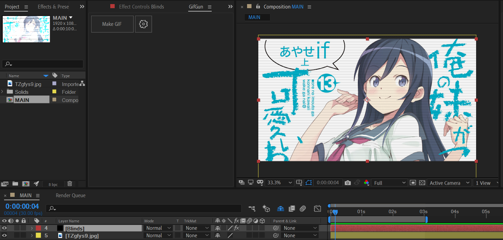
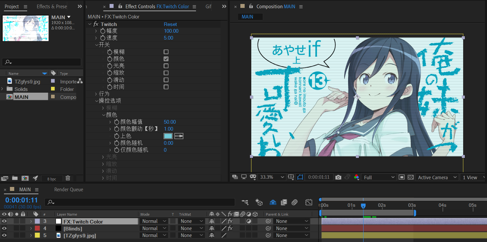
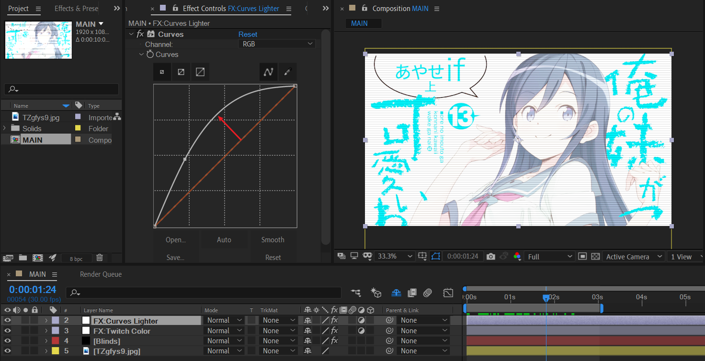
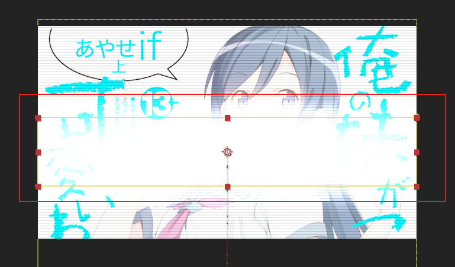
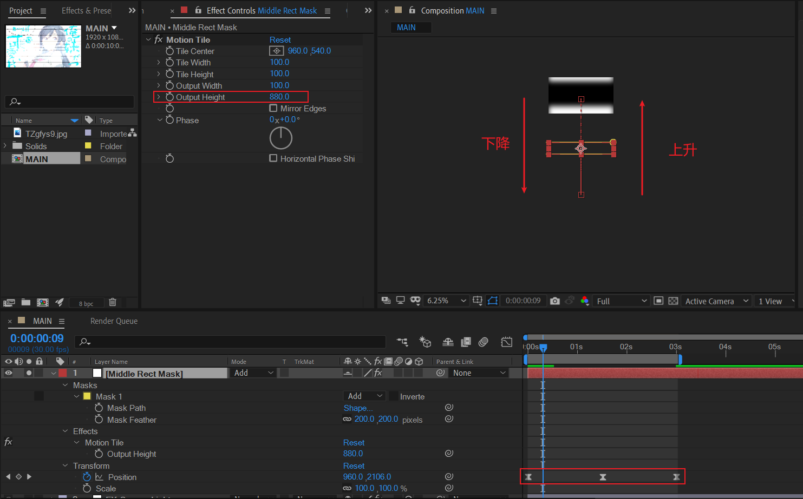
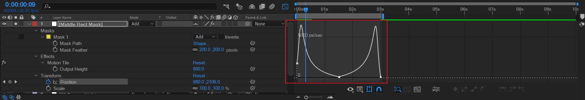
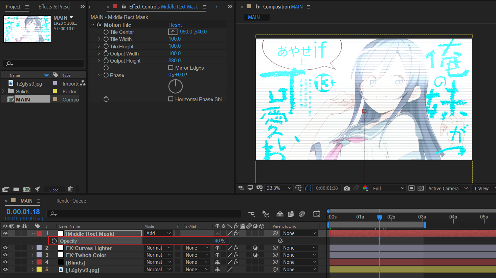

# 仿Another Day中的电频扫光

## 步骤概述

- 使用百叶窗添加横线条纹。

- 使用Twitch添加颜色抖动。

- 使用曲线提高画面整体亮度，并设置亮度抖动。
- 绘制扫光Mask，使用motion tile拼贴垂直方向的副本数量。并制作Y轴上下移动的循环动画。

## 百叶窗添加横线条纹

导入图片后，新建纯色层+百叶窗效果。

## Twitch添加颜色抖动

新建调节层+Twitch效果，打开颜色开关，设置上色为浅蓝色。此时，画面播放时就有了颜色抖动的轻微效果。

## 曲线提高画面整体亮度

新建调节层+曲线，整体提亮画面。

## 制作扫光Mask

新建白色纯色层，绘制一个宽度等于合成宽度，高度略窄的矩形，羽化XY轴，示例中的羽化值为200。设置图层模式为Add，因为这里需要加亮。

接着，添加动态拼贴效果。在输出高度上设置较大数值，以拼贴垂直方向。

然后对图层的位置属性Y制作【下降-上升】的关键帧。

速度曲线如下：

- 下降过程：初始较大的速度，然后急剧减慢速度。 
- 上身过程：速度从低峰开始加大，达到峰值后瞬间下滑到0。

最后，将这个图层的opacity调低到合适数值。

## 参考

- 浅蓝昕MAD教程 第三章 第三节

